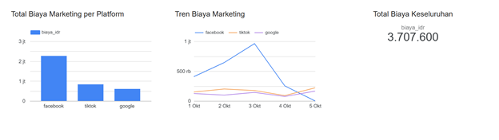
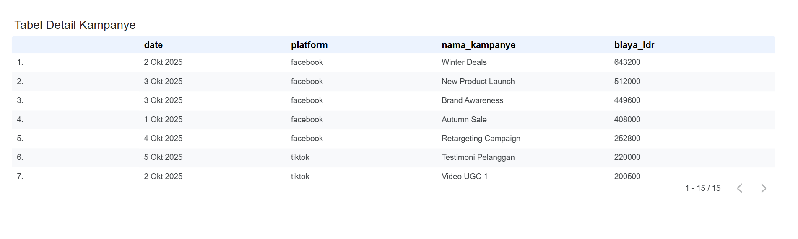

# Marketing Pipeline

### Deskripsi
Proyek ini adalah simulasi nyata dari tantangan interoperabilitas data dalam ekosistem martech (Marketing Technology). Fokusnya adalah melakukan normalisasi dan transformasi data dari tiga sumber utama (Facebook, Google, TikTok) yang masing-masing menghasilkan data CSV dengan skema, konvensi mata uang, dan format tanggal yang unik

Tujuan proyek ini adalah membuat **satu pipeline data terpusat** yang:
1. Membaca semua file CSV mentah.
2. Melakukan **cleaning & standarisasi** (tanggal, mata uang, nama kolom).
3. Menggabungkan seluruh data ke dalam satu tabel yang rapi dengan satuan **IDR**.
4. Memuat data ke **database (BigQuery)**.
5. Menyajikan hasil akhirnya di **Looker Studio** dalam bentuk visualisasi “Total Biaya Iklan per Platform”.

---

### Alur Data (ETL Pipeline)

### **1. Extract**
Mengambil data mentah dari tiga file CSV:
- `fb_ads.csv`
- `google_ads.csv`
- `tiktok_ads.csv`

Setiap file memiliki format berbeda:
| Platform | Kolom Asli | Contoh Masalah |
|-----------|-------------|----------------|
| Facebook | `date`, `campaign_name`, `spend_usd`, `impressions` | Mata uang USD |
| Google | `day`, `campaign_id`, `cost_idr`, `clicks` | Kolom tanggal beda nama |
| TikTok | `tanggal`, `nama_iklan`, `biaya` | Format biaya "Rp 150.000" (harus dibersihkan) |

---

### **2. Transform**
Proses pembersihan dan standarisasi menggunakan **Python (Pandas)**:
- Konversi `spend_usd` → IDR dengan kurs tetap (Rp16.000).
- Hilangkan simbol “Rp” dan titik (`.`) pada kolom biaya TikTok.
- Standarkan semua kolom ke format:
  ```text
  tanggal | platform | nama_kampanye | biaya_idr | metric_1 | metric_2
- Normalisasi format tanggal dengan mengonversi semua nilai tanggal ke format seragam YYYY-MM-DD
- Facebook menggunakan impressions sebagai metric_1, Google menggunakan clicks sebagai metric_1, sedangkan tiktok belum memiliki metrik numerik, sehingga dibiarkan kosong (None) untuk saat ini
- Semua Dataframe digabung menjadi satu tabel bersih

### **3. Load**
Memindahkan data hasil cleaningg ke dalam data warehouse BigQuery:
- Menyiapkan dataset dengan nama **marketing_data** dan tabel target bernama **ads_cleaned** di BigQuery
- Upload dataframe hasil transformasi ke tabel **ads_cleaned**
- Verifikasi data melalui BigQuery Console

---
### Visualisasi Looker Studio


